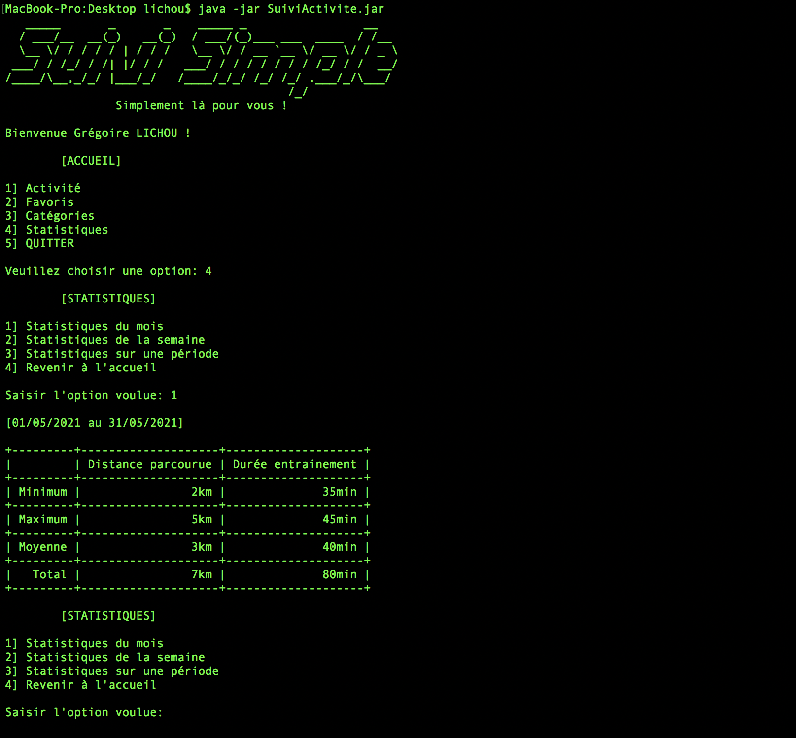

```
   _____       _       _    _____ _                 __   
  / ___/__  __(_)   __(_)  / ___/(_)___ ___  ____  / /__ 
  \__ \/ / / / / | / / /   \__ \/ / __ `__ \/ __ \/ / _ \
 ___/ / /_/ / /| |/ / /   ___/ / / / / / / / /_/ / /  __/
/____/\__,_/_/ |___/_/   /____/_/_/ /_/ /_/ .___/_/\___/ 
                                         /_/             
		Simplement là pour vous !
```

# Suivi d'activite physique

Le projet de suivi d’activité a pour but de réaliser une application dans le langage java. Dans le cadre de notre formation, ce projet s’attachera principalement à la mise en place technique d’objets et leurs utilisations. Ce projet sera réalisé en binôme.

La demande est de concevoir une application de suivi d’activité au quotidien. Elle permettra à l’utilisateur d’analyser sa progression au fil du temps et de lui faciliter la vie  
en aggrégant divers liens (vers des vidéos de coaching, des exercices ou du contenu sportif). 

Cet ensemble de liens favoris, permettra de retrouver plus facilement du contenu et de garder la motivation (en rendant possible, par exemple, la recherche d’une activité d’une courte durée). De ce fait, plus d'excuses pour ne plus s'entraîner ! L’application agira comme un réel compagnon du sportif. 

À chaque session d'entraînement l’utilisateur pourra renseigner les détails de l’activité qu’il vient de réaliser pour, plus tard, consulter les statistiques.

## Captures d'écran



```
	[STATISTIQUES]

1] Statistiques du mois
2] Statistiques de la semaine
3] Statistiques sur une période
4] Revenir à l'accueil

Saisir l'option voulue: 1

[01/05/2021 au 31/05/2021]

+---------+--------------------+--------------------+
|         | Distance parcourue | Durée entrainement |
+---------+--------------------+--------------------+
| Minimum |                2km |              35min |
+---------+--------------------+--------------------+
| Maximum |                5km |              45min |
+---------+--------------------+--------------------+
| Moyenne |                3km |              40min |
+---------+--------------------+--------------------+
|   Total |                7km |              80min |
+---------+--------------------+--------------------+
```

## Documentation

[Javadoc](https://glichou.github.io/SuiviActivitePhysique)